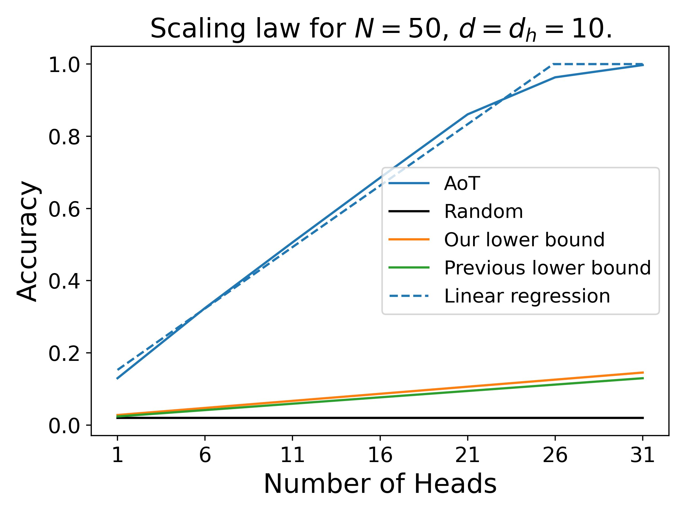

# Memorization in Attention-only Transformers
This repository contains the code base for producing the experiments from our paper *Memorization in Attention-only Transformers* accepted at AISTATS 2025 and available here [Todo]!

The notebook *experiments.ipynb* allows to produce the data present in the folder *Scaling laws*. Each *.py* in that folder allows to analyze the data and create the graphs present in the paper. These images are stored in the folder *Images*.

### Acknowledgements
This is a joint work with Yann Chevaleyre and Muni Sreenivas Pydi, realized at Lamsade, Paris Dauphine University. [Todo] 

## Experiments

Our main theoretical result expressed in Corollary 1 of our paper, is a lower bound on the number of example that an Attention-only Transformer (AoT) can remember. This in turn gives a lower bound on the accuracy of a (well) trained AoT. The accuracy scales at least as: $\frac{1}{N} + (1-\frac{1}{N})\frac{Hd_h}{T_0}$, where $N$ is the number dictionary size, $d$ is the embedding dimension of the network, $H$ is the number of heads in the AoT, $d_h$ the inner dimension of each head, and $T_0$ the number of non-zero probability sentences. Our goal with these experiments was to both compute the empirical scaling of the accuracy, to know how much our bound could be improved, and compare the accuracy of an AoT with the one of a Transformer using MLP.

In experiment 1 to 4, we test the accuracy scaling of an AoT in the parameters $H$, $d_h$ and $d$. E1 tests the scaling in $H$, E2 in $d_h$ and E3 in $d$. We found that the scaling in $H$ and $d_h$ are linear. 

| |  |
|-|-|

For the scaling in $d$, E3 suggests that it is linear by part, but the graph appears noisy for $d>d_h$. To avoid the problem, in E4 we measured the scaling in $H$ by taking $d=d_h$, and then computed the coefficient of each linear relation. Then, the scaling of the coefficient is found cubic. Since a linear component is due to $d_h$, it means that, from the data in E3 and E4, the scaling in $d$ is between linear and quadratic. Thus, the final scaling law is between $CHd_hd$ and $CHd_hd^2$.

|  |  |
|-|-|

In experiment 5, we measured the accuracy of a Transformer with only one attention head (to mix tokens) and an MLP with a varying size. This allowed us to compare the two architectures' accuracy for a given number or parameter. We found that both scalings are the same meaning that MLP and Attention layer can memorize equally well in practice (although this might depend on the optimization procedure).

## Additional experiment: larger dimension and depths

**Appendices to the paper.** We include variations of experiments 1, 2 and 5 featuring larger embedding dimension as well as more depth. We also include experiment 6, which compares the lower bound with the scalings in dimension $d=2$.

|  |  |
|-|-|
|  |  |
|-|-|
|  |  |
|-|-|

